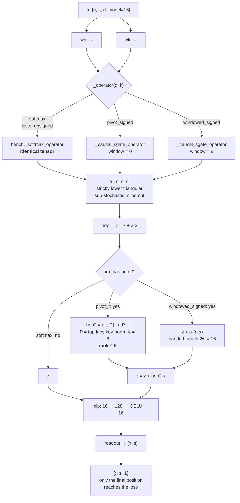
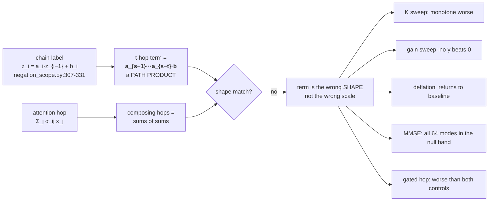
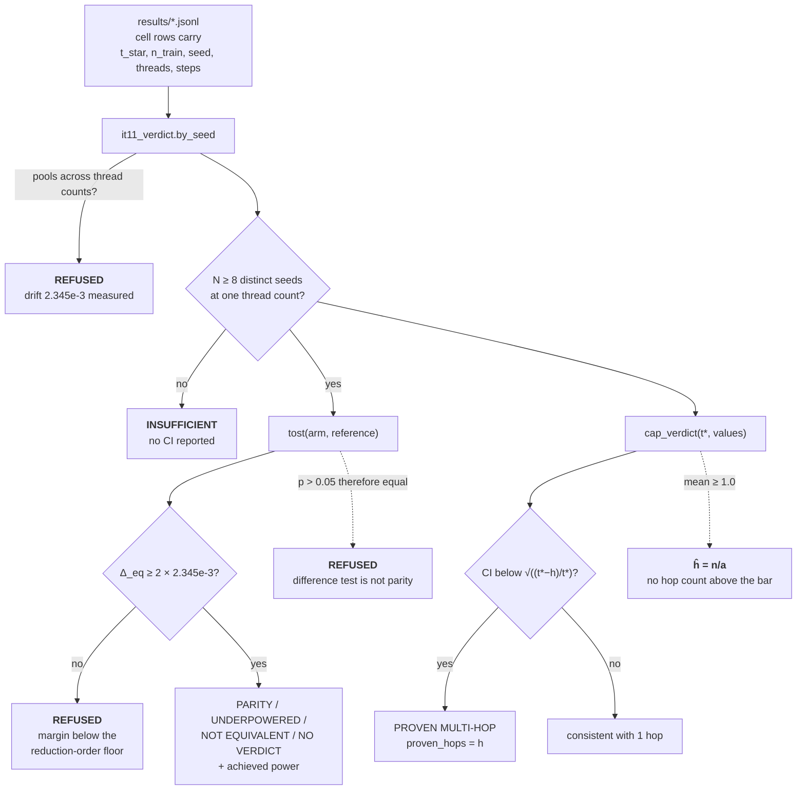
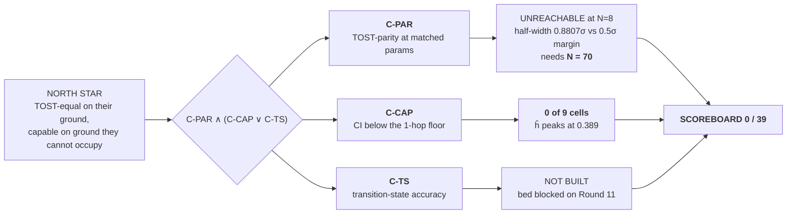
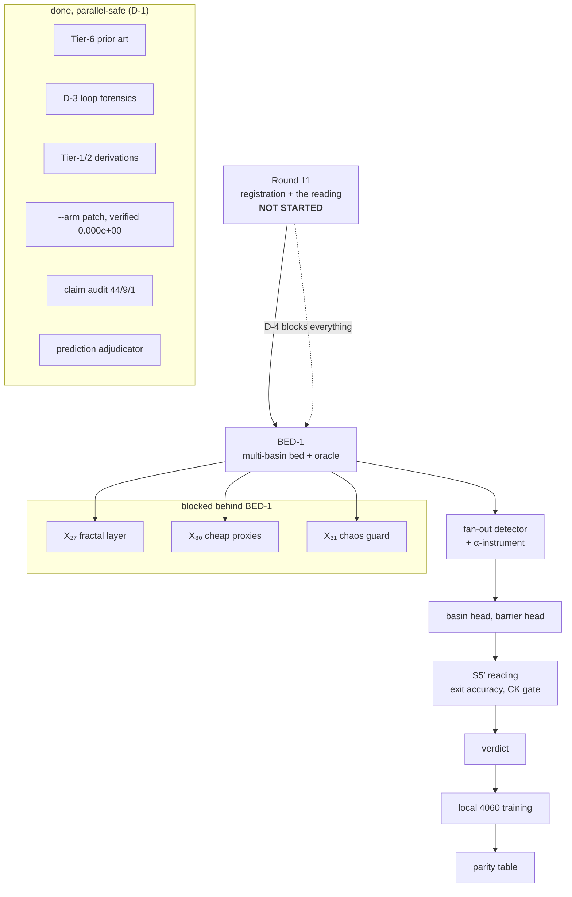
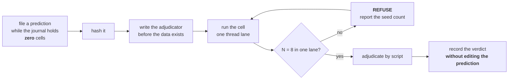

# CEQ — architecture diagrams

Diagrams only. The architecture-and-state document is **`workdonenew.md`**;
`ARCH.md` does not exist and must not be created. Every number appearing here is
carried from `workdonenew.md` and `results/*.jsonl`.

---

## 1. The arm — what actually runs

All four arms share one geometry, one parameter count (`4769`), one MLP and one
readout. Only the operator and the presence of a second hop differ.

**The tail matters.** `Arm.forward` returns `out[:, s-1]`, and the MLP is
position-wise, so only row `s−1` of every operator reaches the loss. Statistics
computed over the whole matrix describe 63 rows that are computed and discarded.

---

## 2. Why the second hop carries nothing

Five independent routes, one conclusion. The full table with every number is in
`workdonenew.md` §6.

---

## 3. The verdict machinery — what each instrument refuses

Every gate is a refusal, not a score. This is the part of the repository that
holds.

---

## 4. The claim ladder, and where it stands

---

## 5. The DAG, and what blocks what

---

## 6. The measurement discipline, as a loop

This loop ran once this round and returned **4/4 held** on a negative result. It
refused twice on the way — at 6/8 seeds, and again when the completing seeds
arrived in the wrong thread lane, which was the author's own error.

---

## 7. Where to look

| question | file |
|---|---|
| what is true, and how far from the goal | `workdonenew.md` |
| every failure mechanism, with its check | `MISTAKES.md` — 54 entries |
| this round's derivations and corrections | `V13_DAG_TASKLIST.md` |
| independent audit of this round's numbers | `V13_CLAIM_AUDIT.md` |
| the numbers themselves | `results/*.jsonl` |
| the proved core | `lean/CEQ/` |
