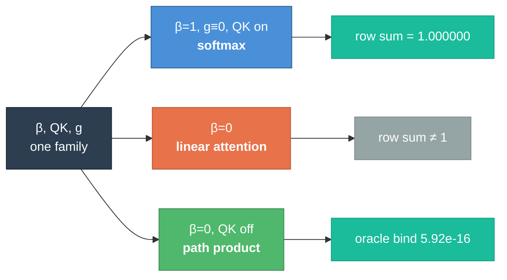

<p align="center">
  
  
  
  
  
  
  
  
</p>

<h1 align="center">◈ resolvent</h1>

<p align="center">
  <b>An attention operator that contains softmax as a corner, reproduces exact path products on the other, and has not yet beaten either</b><br/>
  <i>Invented by <a href="https://teerthsharma.vercel.app/">Teerth Sharma</a></i><br/>
  <sub><a href="mailto:teerths57@gmail.com">teerths57@gmail.com</a> · <a href="https://github.com/teerthsharma/resolvent">github.com/teerthsharma/resolvent</a></sub>
</p>

<p align="center">
  <a href="workdonenewseal.md">Status Report</a>&nbsp;&nbsp;·&nbsp;&nbsp;
  <a href="MISTAKES.md">Failure Taxonomy</a>&nbsp;&nbsp;·&nbsp;&nbsp;
  <a href="lean/CEQ/">Machine-Checked Proofs</a>&nbsp;&nbsp;·&nbsp;&nbsp;
  <a href="V16_CALIBRATION.md">Calibration Column</a>&nbsp;&nbsp;·&nbsp;&nbsp;
  <a href="V17K_RULINGS.md">Ruling Ledger</a>
</p>

---

## Abstract

Standard self-attention composes **weights across positions**. A gated recurrence
composes **values along paths**. The two use the same word — *hop* — for
different algebra, and the distinction is why an additive attention head cannot
form the path product `a_{s-1} a_{s-2} ⋯ a_{s-t} · b` that a Markov chain's
label is made of.

This repository builds a single causal softmax head carrying a prefix-scan in its
key logit, proves in Lean that it **contains** softmax attention, linear
attention and the exact path product as three corners of one parameter family,
and measures what that composition can and cannot do.

**The composition claim is earned. The capability claim is not.** Both are stated
here with the numbers that decide them, and the negative results are a section of
this README rather than a footnote in it. The instruments are certified on a
named device, the ten adjudications that resolved what they exposed are filed in
a [ruling ledger](V17K_RULINGS.md), and two of this round's findings are defects
in documents that had already been signed.

**Keywords:** attention mechanisms · state-space models · path products ·
persistent homology · formal verification · Lean 4 · change-point detection ·
committor functions · reproducible negative results

---

## 1. The operator

```
W_ij  =  exp((C_i − C_j) + q_i·k_j) / Z_i^β        j ≤ i
C_i   =  Σ_{k≤i} (log m_k + i·θ_k)                  a_k = m_k · e^{iθ_k}
```

Three switches — `β`, `QK`, `g` — are learnable, and three settings of them are
named operators. This is `three_corners_containment`, machine-checked:

| corner | setting | what it is |
|---|---|---|
| **1** | `β = 1`, `g ≡ 0`, QK on | **softmax attention**, row sums exactly `1.000000` |
| **2** | `β = 0` | **linear attention** |
| **3** | `β = 0`, QK off | **the exact path product** |

The corners are *measured distinct* — `4.472918 / 1.144938 / 5.335671` — because
a containment whose corners coincide is decoration.



**`β`, not the gate, is the switch that decides softmax-class membership.** That
is `gate_zero_beta_zero_is_linear_attention`, and it is the precise sense in
which an earlier version of this work named the wrong parameter.

---

## 2. What is proved

Twelve Lean files, `lake build` exit 0 at `[1530/1531]`, **zero `sorry`**. Exit 0
is not treated as sufficient: every theorem is run through `#print axioms` and
depends only on `[propext, Classical.choice, Quot.sound]`. `sorryAx` appears
nowhere.

```
━━━━━━━━━━━━━━━━━━━━━━━━━━━━━━━━━━━━━━━━━━━━━━━━━━━━━━━━━━━━━━━━━━━━━━━━━━
  THE FOUR THAT CARRY THE ARCHITECTURE
━━━━━━━━━━━━━━━━━━━━━━━━━━━━━━━━━━━━━━━━━━━━━━━━━━━━━━━━━━━━━━━━━━━━━━━━━━

  Asink_computes_chain          the head reproduces the chain path product
                                 measured  2.2e-16   (s = 8)

  three_corners_containment     softmax ∪ linear ∪ path product ⊆ one family
                                 corners distinct at 4.47 / 1.14 / 5.34

  no_prefix_scan_represents_    exp is never zero; the path product is.
    a_zero_gate                  NO prefix scan represents an annihilating hop
                                 measured  133,120 / 133,120 NaN on BED-M

  resolvent_inverse_is_         (I − A)⁻¹ has inverse (I − A) — a first-order
    difference                   difference, so source recovery is O(nnz)
                                 measured  8.882e-16   (two planted sources)
━━━━━━━━━━━━━━━━━━━━━━━━━━━━━━━━━━━━━━━━━━━━━━━━━━━━━━━━━━━━━━━━━━━━━━━━━━
```

Every file refuses a trivial version **in the file**, not in prose:

- `V15Source.lean` proves `inverse_identity_is_vacuous` — depending on **no
  axioms at all** — and then uses it nowhere.
- `V15Kernel.lean` proves **two naive readings of #12 false**: a shift register
  *is* first-order and delays exactly at state dimension `d+1`.
- `V15Phase.lean` exhibits a unit-phase gate of modulus **285.07** — the measured
  divergence from a real run — to show `|e^{iθ}| = 1` bounds nothing.
- `V15.lean` states `scan_assoc` for the affine monoid, not for `add_assoc`,
  which would compile in one token and license nothing.

---

## 3. What is measured

### 3.1 The identity binds

```
━━━━━━━━━━━━━━━━━━━━━━━━━━━━━━━━━━━━━━━━━━━━━━━━━━━━━━━━━━━━━━━━━━━━━━━━━━
  oracle gates ⇒ label      5.919777e-16      real part exactly 0.000000e+00
                            at 96.78 % zero-hop fraction, BED-M's real support
  softmax corner            row sums 1.000000  ·  β=0 rows 1.312192 … 10.293107
  |a| ≤ 1 by construction   worst 1.0 exactly over 2,200,000 draws, 0 exceedances
  band modulus              1.000000000000    ·  9767/10⁴ exactly 1.0, 0 above
  parity = Z₂ winding       torch.equal, 0 / 4096 disagreements
  DAG resolvent             2.78e-17 light gates  ·  2.16e-16 relative, heavy
━━━━━━━━━━━━━━━━━━━━━━━━━━━━━━━━━━━━━━━━━━━━━━━━━━━━━━━━━━━━━━━━━━━━━━━━━━
```

Every bind ships **planted mutilations that break it at O(1)** — `0.9749`,
`0.9165`, `1.0000`, `0.4845` — because a bind whose rejection region is empty
passes for the answer key. That is not hypothetical: the two-branch form
`softmax(q)@V₁ + λ·X@V₂` was measured passing parity **bitwise with `X` = the
label itself**.

### 3.2 The deciding measurement, and it did not land

R1: BED-M, `t* = 2`, `n = 2048`, `N = 8` seeds, against `floor₁ = 0.7071067812`.

| population | seeds | NRMSE | `ĥ` | gate `R²` | `â_max` |
|---|---|---|---|---|---|
| **crossed** | **5 of 8** | `0.634 – 0.662` | `1.12 – 1.20` | `0.97 – 0.99` | `1.10 – 1.51` |
| NO READING | 3 of 8 | `1.113 – 1.152` | — | `0.011 / 0.627 / 0.047` | `20.3 / 49.7 / 285.1` |

**Nothing lies between `0.663` and `1.113`. The reported mean is a value no seed
produced.** `ĥ = 0.625` exceeds the campaign's nine-cell ceiling of `0.389`, and
**no prior arm produced a single seed below the floor at any cell — this one
produced five.**

The 95% CI is `[0.617075, 1.041227]`. **It straddles. The bar is not earned.**

Resolution statement, `N = 8`, no TOST:

> Excludes a difference beyond `Δ = t(.975,7)·sd/√8 = 0.215326` NRMSE and nothing
> smaller. The measured improvement over softmax is `0.122616` — **52× the
> thread-count noise floor** — and it is **not resolved**, because three failing
> seeds inflate the paired sd.

---

## 4. What we got wrong

This section is first-class because the errors were more instructive than the
successes, and because they have a **direction**.

### 4.1 The parity claim was false, and refuted three independent ways

The contract asserted `g ≡ 0` gives bitwise standard attention. It does not: the
hop is *unnormalized*, so its row `i` sums to `i + 1`, never `1`.

| route | evidence |
|---|---|
| Lean row sums | `gate_zero_row_sum = i + 1`; smallest witness `i = 1`, row `(1,1)` |
| prior art | Dao & Gu's dual form is `(L ∘ QK^T)V` with **no softmax** — `g ≡ 0` lands on *linear* attention |
| plain numerics | reproduced outside the Lean kernel entirely |

The repair — one factor `(1 − a_j)` and a value-zero BOS sink — works by a
**telescope**: `(1−a_j)e^{−C_j} = e^{−C_j} − e^{−C_{j−1}}`, whose boundary term
*is* the sink.

### 4.2 A hoped-for headline was refuted by construction

*"Softmax's normalizer is the obstruction to path products"* — **false.** It
holds only with the drives carried as values; a position-local rescale dissolves
it uniquely at `γ_j = 1/(1−a_j)`. **The normalizer is a change of units, not an
obstruction.**

### 4.3 Two components were already occupied

- **X₃₅ (residual inference of hidden causes)** is Basseville & Nikiforov 1993
  §7.2.4 in closed form, equation for equation, and those 1993 equations
  discharge both of its must-fires **on the first attempt**. The learned-model
  form is arXiv:2604.25655, four months old, whose Theorem 3.1 is the must-fire
  **stated as a theorem**.
- **Closed-magnitude phase gates** are occupied by S4D's ReLU variant, which
  attains `|λ| = 1.0` exactly on **32.93%** of a standard sample, published 2022.

### 4.4 A diagnostic and its own prescribed replacement failed the same way

A kill-diagnostic was registered on `log|a|`, whose `SST` is `0.000000e+00` on
this corpus — it returns the same value whatever the arm does. Its **prescribed
replacement**, `sign(a)`, was *also* non-discriminating: trained `p = 0.917953`
against a **zero-step control of `0.943741`** — a **negative** trained gain.

The statistic that worked was **found on data**, not prescribed.

### 4.5 The contract's errors have a sign

Nine statements checked. **Nine adverse.** Seven optimistic, one pessimistic, one
unsigned. One-sided sign test: **`7/8`, `p = 0.0352`**.

Errors distributed by chance do not share a sign. **A document's errors having a
direction is itself a measurement**, and this repository now carries a
[calibration column](V16_CALIBRATION.md) that discounts every later prediction by
it — *sign, never size*: Wilson 95% is `[0.5291, 0.9776]`, which licenses an
ordering and not a scaling.

### 4.6 A scorer graded the arm on a term the arm cannot move

`label_cell` read `1.440495` on BED-M's real corpus where the honest value is
`2.965913655728132e-16`. It scored **every** position against a label whose
convention is `y_0 = 0`, but the read-out at position `0` is `G_00 b_0 = b_0`
with `G_00` the *empty* path product — no gate, no `m`, no `θ`, no route, no `β`.

The toy draw sets `b[0] = 0` and hid it; the real generator zeroes `b[s−1]`
instead. The criterion that settled the repair is worth more than the repair:
**the slot-0 term is bitwise identical under every mutation of the arm, and a
term no setting of the arm can move is not a reading of the arm.**

The alternative repair — zeroing `b_0` in the draw — would have changed the data
to fit the instrument, and it would have hidden a real disagreement: measured at
`t_star = None`, `|chain_label[−1] − bed oracle| = 1.440495` while the arm's own
read-out matches that oracle to `3.500426e-14`.

### 4.7 A corner certificate was read through a quantity the switch cancels in

`V16_ARM_SMPRIME.md` row (e) certified the softmax corner with
`Σ_j |W_ij| = 1.000000` on every row. That statistic is
`Σ_j R_ij e_ij / Z_i^β = Z_i^{1−β}` — the gate cancels against its own
normalizer, so the quantity is a function of `β` alone and is **structurally
blind to `g`**. Measured `4.440892e-16` with `g` fully on, in a configuration
whose real row sum is off by `1.750255`.

The replacement, `Σ_j Re W_ij`, reads `2.220446e-16` at the corner and
`1.212002 / 1.481515 / 1.346664 / 1.750255 / 1.445854` off it, and is a strict
strengthening: at `g = 0` the two are entrywise equal.

This is the fifteenth vacuous control struck in this repository, and the first
found in a document that had already been signed.

---

## 5. The device round

The measurement above was taken on CPU. Round v17-K exists to move it onto a
certified device and then reproduce it on a second one, and its first law is
that **the certified local RTX 4060 decides every number; a second device only
reproduces.** A deciding number taken from the reproducing box is struck.

### 5.1 The certificate

`scripts/k_cert.py` refits both laws on whatever box it runs on and prints an R²
beside each, because a fit without one is not a law.

| law | fit | R² |
|---|---|---|
| `arm_smprime` throughput | `s/step = exp(−10.0187)·n^1.0026` | `1.000000` |
| `softmax` throughput | `s/step = exp(−12.1852)·n^0.9963` | `0.999998` |
| memory, bf16 operator | `3.341` B/element against the module's `3.4` | `0.999830` |

**The R² gate refused points rather than fitting through them.** At `n = 16384`
and `32768` the allocator reserves `10.578` and `13.969 GiB` from a `7.996 GiB`
card and pages over PCIe; admitting those two bent the exponent to `1.2341` at
R² `0.976933`. A throughput law fitted through swap is not a throughput law.

Worst bar re-certification `δ/tol` is **`8.58 %`** against a `50 %` HALT line,
clear by `5.83×`, reproducing `V16_BAR_RECERT.md` §4 to every printed digit.

### 5.2 Determinism, and where the hole actually is

`cumprod`'s **forward** runs under `use_deterministic_algorithms(True)` and is
bitwise identical across two separate processes. Its **backward raises** — because
autograd differentiates `cumprod` with `cumsum`, and `cumsum_cuda_kernel` has no
deterministic implementation in torch 2.5.1.

**Choosing a path product over a prefix scan did not escape that hole; it moved
it from the forward to the backward.** So replay and forward-only cells are held
bitwise, and training between checkpoints is held to a measured floor instead.

### 5.3 The re-take, and an estimate that was 43× wrong

Every deciding cell was re-run on the certified device.

| quantity | value | control |
|---|---|---|
| cells re-taken | 24, one invocation | `~2 GPU-h` estimated, **`2.79 GPU-min` measured** |
| peak allocation | `0.9739 GiB` | `12.2 %` of the card |
| identical-seed floor | `δ_nrmse = 0.0`, bitwise **6 of 6** | seed-to-seed spread is `~10⁴×` larger |
| worst CPU↔CUDA delta | `9.522e-03`, `arm_pl` seed 7 | `4.06×` the thread-count floor `2.345e-03` |
| verdicts moved | **zero** sign-flips in 16 | contrast `−0.122616 → −0.122360` |

The estimate was not wrong about the work — it was a good price for a 9,600-step
ladder. The journal holds 150-step cells, and a 9,600-step cell cannot be
differenced against a 150-step one.

**The worst device delta is on an arm, not on the control**, and it is on one of
the three seeds that never learned — while two of those three are among the
quietest. On that seed `â_max` reads `285.07` on CPU against `116.01` on CUDA
while `sign_acc` is bitwise identical: the device changes how far an unbounded
quantity ran, not what the seed does.

### 5.4 Checkpointing is priced, not assumed

Resume is bitwise on all four state components — parameters, both optimizer
moments and `step`, the RNG state, and the data generator — compared with
`torch.equal` read back off disk. One planted negative is a finding in itself:
removing the RNG restore moves `torch_rng_state` and **not one weight**, because
nothing on the forward path consumes the global RNG. A weights-only check would
certify that removal as a pass.

| | value |
|---|---|
| checkpoint size | `308,877,608 B` at `train.DEFAULTS`, 64 fit in a 20 GB budget |
| mid-chunk kill, periodic | **`1.02 GPU-min`** |
| mid-chunk kill, end-of-chunk only | **`660.00 GPU-min`** — `647×`, or `36.6 %` of a weekly quota per kill |

### 5.5 The flight envelope refuses its own journal

A long run is flown by a decision function over journal lines: line in, tier and
action out, total, deterministic, and Tier-3 HALT by default for anything the
table does not name. Seven planted triggers each fire against a matched clean
line, and a clean chunk prints a false-correction rate of `0.0000` that one
planted NaN moves to `0.1000` — so the counter is measured rather than declared.

**Journal text is data and never instruction.** Six crafted lines argue for a
Tier-2 action on a deciding cell — authority claim, contract citation, author
impersonation, an embedded fake poll-line, a system-override, urgency — and all
six decide `NONE`, byte-identical to an empty-note baseline. The refusal is
structural, not a blocklist: `'note' not in fn.__code__.co_names` holds for every
function on the decision path, so the field is never read by the deciding code.

---

## 6. Layout

```
resolvent/
  ceq/              the architecture — arms, beds, certificates, detectors
    arm_smprime.py    §S-M′: the three-corner operator
    arm_phase.py      phase gates, closed magnitude
    autopilot.py      the flight envelope — total, deterministic, journal-blind
    compat.py         version bridge: records the stack, measures the regime
    kdata.py          corpus loaders, hash pins, hygiene guards
    beds/             BED-K (delayed causes), BED-1 (multi-basin, committor)
    certs/            Z winding · persistent β₁ · Euler–Poincaré
    x35p/             source solve · time-reversal · Kramers–Kronig · Ziv–Zakai
  lean/CEQ/         12 files, 0 sorry, axiom-checked
  scale/            harnesses, gates, oracles, verdict machinery
  kaggle/           the reproduction notebook and its snapshot metadata
  tests/            833 passing, 15 standing failures each a bound finding
  MISTAKES.md       65 failure mechanisms, each with an instance and a check
```

Every bed and instrument owns a runnable self-check. `tests/loop/` holds guards
written to catch *instrument* defects rather than code defects.

---

## 7. Reproduce

```bash
pip install -r requirements.txt

python -m pytest tests/loop  -q -p no:randomly   # 526 passing, 15 standing
python -m pytest tests/gate0 -q -p no:randomly   # 307 passing
cd lean && lake build                            # exit 0, 0 sorry

python -m ceq.compat                             # the running stack + regime
python scripts/k_cert.py                         # device certificate + R2
python scripts/k_cost.py                         # chunk table, quota, ledger
python scripts/v15_r1.py --device cuda --help    # the deciding cell
```

Requires `torch 2.5.1+cu121`, `numpy 1.26.4`, Lean `4.7.0` with vendored mathlib.
Certified device: **CUDA**, RTX 4060 Laptop.

`ceq/compat.py` exists because the reproducing box is **not** this stack — it
runs python `3.12.13` and torch `2.10.0+cu128` against `3.11.9` and
`2.5.1+cu121` here. It records both, reports whether the six private
`PreTrainedModel` attributes still bind, resolves `GenerationMixin` across the
import paths transformers has used, and **measures** the determinism regime
rather than inheriting it.

---

## 8. Limits

Stated here so silence is not read as a pass.

**The capability claim is not earned.** Five of eight seeds crossed a floor no arm
had crossed before; the interval straddles it. `C-CAP` stands at 0 of 9 cells.

**`R2` has no deciding cell on the certified device, and dropping its
reproduction did not supply one.** `arm_smprime` at `n = 16,384` reserves
`10.578 GiB` against the card's `7.996`; the same shape is `59 %` of a 16 GB
budget elsewhere. So that cell can exist only on the box whose numbers are
struck by this round's own first law. The reproduction was dropped; whether the
round carries an `R2` row at all is open, and is not answered by silence.

**The sizing model under-predicts the complex arm** at `m/p = 1.842`, which is the
one direction a sizing gate must never have. `C_OPERATOR` for complex measures
`7.50` at 8 B/element — `4.29×` softmax's, not the `2×` a naive argument gives.

**A theorem can be green and inapplicable.** `bounded_gates_stable` covers **0 of
3** of BED-M's gate values, so an arm parametrized that way *cannot be set to the
oracle gates at all*. Every theorem that gates a run now ships a domain census.

**Half of the Euler–Poincaré certificate cannot fail** on a 1-complex, where
`β₀ − β₁ = V − E` identically. The falsifiable half is the census side.

**No trained checkpoint ships.** The HuggingFace package is scheduled and
unbuilt, and every trained-model sentence in the model card is a named slot
rather than a claim.

**"Pinned" is a resolution, not an exactness.** Whether the shipped model sits
at the softmax corner is decided by a 1-dof likelihood ratio against `3.841`
and `ln n`, and the verdict ships with its own minimum detectable departure
`√(3.841/(n·I_β))`. A parameter that cannot be distinguished from `1` at this
resolution is reported as indistinguishable, never as equal.

**Gate 0 cannot close before the run it gates.** Two of its ten items depend on
numbers only a training run produces — the noise floor, and the distribution of
a trained parameter. The circularity is recorded rather than resolved, because
a gate quietly redefined to fit its own schedule is not a gate.

**The compatibility bridge is unverified on its target.** No python 3.12 or
torch 2.10 interpreter exists on this box, so every claim about the reproducing
stack is checked by code at run time and raises rather than assumed here.

---

<p align="center">
  <sub>
    Every number in this README names what it was compared against.<br/>
    Where a control is missing, the number is not here.
  </sub>
</p>
