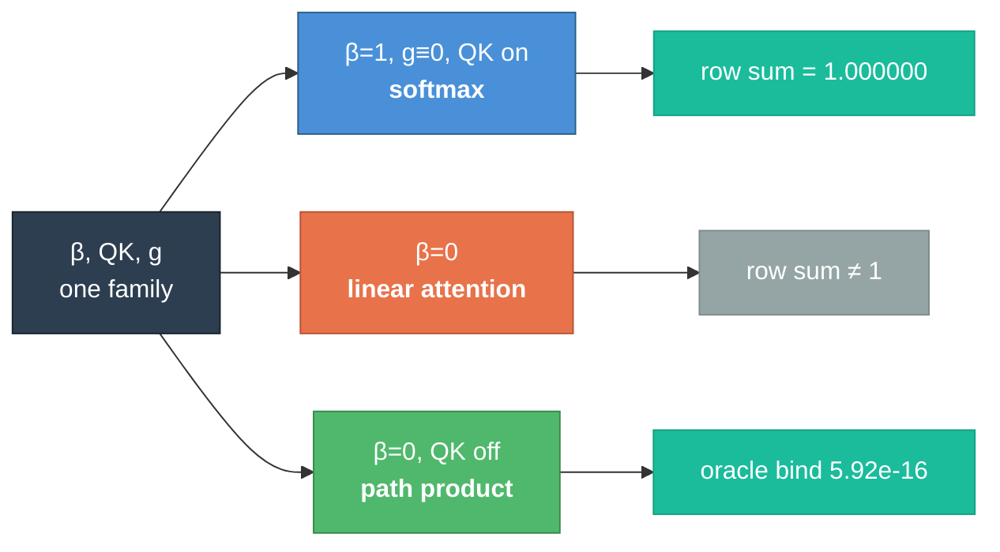

<p align="center">
  
  
  
  
  
  
  
</p>

<h1 align="center">◈ resolvent</h1>

<p align="center">
  <b>An attention operator that contains softmax as a corner, reproduces exact path products on the other, and has not yet beaten either</b><br/>
  <i>Invented by <a href="https://teerthsharma.vercel.app/">Teerth Sharma</a></i><br/>
  <sub><a href="mailto:teerths57@gmail.com">teerths57@gmail.com</a> · <a href="https://github.com/teerthsharma/resolvent">github.com/teerthsharma/resolvent</a></sub>
</p>

<p align="center">
  <a href="workdonenewseal.md">Status Report</a>&nbsp;&nbsp;·&nbsp;&nbsp;
  <a href="MISTAKES.md">Failure Taxonomy</a>&nbsp;&nbsp;·&nbsp;&nbsp;
  <a href="lean/CEQ/">Machine-Checked Proofs</a>&nbsp;&nbsp;·&nbsp;&nbsp;
  <a href="V16_CALIBRATION.md">Calibration Column</a>
</p>

---

## Abstract

Standard self-attention composes **weights across positions**. A gated recurrence
composes **values along paths**. The two use the same word — *hop* — for
different algebra, and the distinction is why an additive attention head cannot
form the path product `a_{s-1} a_{s-2} ⋯ a_{s-t} · b` that a Markov chain's
label is made of.

This repository builds a single causal softmax head carrying a prefix-scan in its
key logit, proves in Lean that it **contains** softmax attention, linear
attention and the exact path product as three corners of one parameter family,
and measures what that composition can and cannot do.

**The composition claim is earned. The capability claim is not.** Both are stated
here with the numbers that decide them, and the negative results are a section of
this README rather than a footnote in it.

**Keywords:** attention mechanisms · state-space models · path products ·
persistent homology · formal verification · Lean 4 · change-point detection ·
committor functions · reproducible negative results

---

## 1. The operator

```
W_ij  =  exp((C_i − C_j) + q_i·k_j) / Z_i^β        j ≤ i
C_i   =  Σ_{k≤i} (log m_k + i·θ_k)                  a_k = m_k · e^{iθ_k}
```

Three switches — `β`, `QK`, `g` — are learnable, and three settings of them are
named operators. This is `three_corners_containment`, machine-checked:

| corner | setting | what it is |
|---|---|---|
| **1** | `β = 1`, `g ≡ 0`, QK on | **softmax attention**, row sums exactly `1.000000` |
| **2** | `β = 0` | **linear attention** |
| **3** | `β = 0`, QK off | **the exact path product** |

The corners are *measured distinct* — `4.472918 / 1.144938 / 5.335671` — because
a containment whose corners coincide is decoration.



**`β`, not the gate, is the switch that decides softmax-class membership.** That
is `gate_zero_beta_zero_is_linear_attention`, and it is the precise sense in
which an earlier version of this work named the wrong parameter.

---

## 2. What is proved

Twelve Lean files, `lake build` exit 0 at `[1530/1531]`, **zero `sorry`**. Exit 0
is not treated as sufficient: every theorem is run through `#print axioms` and
depends only on `[propext, Classical.choice, Quot.sound]`. `sorryAx` appears
nowhere.

```
━━━━━━━━━━━━━━━━━━━━━━━━━━━━━━━━━━━━━━━━━━━━━━━━━━━━━━━━━━━━━━━━━━━━━━━━━━
  THE FOUR THAT CARRY THE ARCHITECTURE
━━━━━━━━━━━━━━━━━━━━━━━━━━━━━━━━━━━━━━━━━━━━━━━━━━━━━━━━━━━━━━━━━━━━━━━━━━

  Asink_computes_chain          the head reproduces the chain path product
                                 measured  2.2e-16   (s = 8)

  three_corners_containment     softmax ∪ linear ∪ path product ⊆ one family
                                 corners distinct at 4.47 / 1.14 / 5.34

  no_prefix_scan_represents_    exp is never zero; the path product is.
    a_zero_gate                  NO prefix scan represents an annihilating hop
                                 measured  133,120 / 133,120 NaN on BED-M

  resolvent_inverse_is_         (I − A)⁻¹ has inverse (I − A) — a first-order
    difference                   difference, so source recovery is O(nnz)
                                 measured  8.882e-16   (two planted sources)
━━━━━━━━━━━━━━━━━━━━━━━━━━━━━━━━━━━━━━━━━━━━━━━━━━━━━━━━━━━━━━━━━━━━━━━━━━
```

Every file refuses a trivial version **in the file**, not in prose:

- `V15Source.lean` proves `inverse_identity_is_vacuous` — depending on **no
  axioms at all** — and then uses it nowhere.
- `V15Kernel.lean` proves **two naive readings of #12 false**: a shift register
  *is* first-order and delays exactly at state dimension `d+1`.
- `V15Phase.lean` exhibits a unit-phase gate of modulus **285.07** — the measured
  divergence from a real run — to show `|e^{iθ}| = 1` bounds nothing.
- `V15.lean` states `scan_assoc` for the affine monoid, not for `add_assoc`,
  which would compile in one token and license nothing.

---

## 3. What is measured

### 3.1 The identity binds

```
━━━━━━━━━━━━━━━━━━━━━━━━━━━━━━━━━━━━━━━━━━━━━━━━━━━━━━━━━━━━━━━━━━━━━━━━━━
  oracle gates ⇒ label      5.919777e-16      real part exactly 0.000000e+00
                            at 96.78 % zero-hop fraction, BED-M's real support
  softmax corner            row sums 1.000000  ·  β=0 rows 1.312192 … 10.293107
  |a| ≤ 1 by construction   worst 1.0 exactly over 2,200,000 draws, 0 exceedances
  band modulus              1.000000000000    ·  9767/10⁴ exactly 1.0, 0 above
  parity = Z₂ winding       torch.equal, 0 / 4096 disagreements
  DAG resolvent             2.78e-17 light gates  ·  2.16e-16 relative, heavy
━━━━━━━━━━━━━━━━━━━━━━━━━━━━━━━━━━━━━━━━━━━━━━━━━━━━━━━━━━━━━━━━━━━━━━━━━━
```

Every bind ships **planted mutilations that break it at O(1)** — `0.9749`,
`0.9165`, `1.0000`, `0.4845` — because a bind whose rejection region is empty
passes for the answer key. That is not hypothetical: the two-branch form
`softmax(q)@V₁ + λ·X@V₂` was measured passing parity **bitwise with `X` = the
label itself**.

### 3.2 The deciding measurement, and it did not land

R1: BED-M, `t* = 2`, `n = 2048`, `N = 8` seeds, against `floor₁ = 0.7071067812`.

| population | seeds | NRMSE | `ĥ` | gate `R²` | `â_max` |
|---|---|---|---|---|---|
| **crossed** | **5 of 8** | `0.634 – 0.662` | `1.12 – 1.20` | `0.97 – 0.99` | `1.10 – 1.51` |
| NO READING | 3 of 8 | `1.113 – 1.152` | — | `0.011 / 0.627 / 0.047` | `20.3 / 49.7 / 285.1` |

**Nothing lies between `0.663` and `1.113`. The reported mean is a value no seed
produced.** `ĥ = 0.625` exceeds the campaign's nine-cell ceiling of `0.389`, and
**no prior arm produced a single seed below the floor at any cell — this one
produced five.**

The 95% CI is `[0.617075, 1.041227]`. **It straddles. The bar is not earned.**

Resolution statement, `N = 8`, no TOST:

> Excludes a difference beyond `Δ = t(.975,7)·sd/√8 = 0.215326` NRMSE and nothing
> smaller. The measured improvement over softmax is `0.122616` — **52× the
> thread-count noise floor** — and it is **not resolved**, because three failing
> seeds inflate the paired sd.

---

## 4. What we got wrong

This section is first-class because the errors were more instructive than the
successes, and because they have a **direction**.

### 4.1 The parity claim was false, and refuted three independent ways

The contract asserted `g ≡ 0` gives bitwise standard attention. It does not: the
hop is *unnormalized*, so its row `i` sums to `i + 1`, never `1`.

| route | evidence |
|---|---|
| Lean row sums | `gate_zero_row_sum = i + 1`; smallest witness `i = 1`, row `(1,1)` |
| prior art | Dao & Gu's dual form is `(L ∘ QK^T)V` with **no softmax** — `g ≡ 0` lands on *linear* attention |
| plain numerics | reproduced outside the Lean kernel entirely |

The repair — one factor `(1 − a_j)` and a value-zero BOS sink — works by a
**telescope**: `(1−a_j)e^{−C_j} = e^{−C_j} − e^{−C_{j−1}}`, whose boundary term
*is* the sink.

### 4.2 A hoped-for headline was refuted by construction

*"Softmax's normalizer is the obstruction to path products"* — **false.** It
holds only with the drives carried as values; a position-local rescale dissolves
it uniquely at `γ_j = 1/(1−a_j)`. **The normalizer is a change of units, not an
obstruction.**

### 4.3 Two components were already occupied

- **X₃₅ (residual inference of hidden causes)** is Basseville & Nikiforov 1993
  §7.2.4 in closed form, equation for equation, and those 1993 equations
  discharge both of its must-fires **on the first attempt**. The learned-model
  form is arXiv:2604.25655, four months old, whose Theorem 3.1 is the must-fire
  **stated as a theorem**.
- **Closed-magnitude phase gates** are occupied by S4D's ReLU variant, which
  attains `|λ| = 1.0` exactly on **32.93%** of a standard sample, published 2022.

### 4.4 A diagnostic and its own prescribed replacement failed the same way

A kill-diagnostic was registered on `log|a|`, whose `SST` is `0.000000e+00` on
this corpus — it returns the same value whatever the arm does. Its **prescribed
replacement**, `sign(a)`, was *also* non-discriminating: trained `p = 0.917953`
against a **zero-step control of `0.943741`** — a **negative** trained gain.

The statistic that worked was **found on data**, not prescribed.

### 4.5 The contract's errors have a sign

Nine statements checked. **Nine adverse.** Seven optimistic, one pessimistic, one
unsigned. One-sided sign test: **`7/8`, `p = 0.0352`**.

Errors distributed by chance do not share a sign. **A document's errors having a
direction is itself a measurement**, and this repository now carries a
[calibration column](V16_CALIBRATION.md) that discounts every later prediction by
it — *sign, never size*: Wilson 95% is `[0.5291, 0.9776]`, which licenses an
ordering and not a scaling.

---

## 5. Layout

```
resolvent/
  ceq/              the architecture — arms, beds, certificates, detectors
    arm_smprime.py    §S-M′: the three-corner operator
    arm_phase.py      phase gates, closed magnitude
    beds/             BED-K (delayed causes), BED-1 (multi-basin, committor)
    certs/            Z winding · persistent β₁ · Euler–Poincaré
    x35p/             source solve · time-reversal · Kramers–Kronig · Ziv–Zakai
  lean/CEQ/         12 files, 0 sorry, axiom-checked
  scale/            harnesses, gates, oracles, verdict machinery
  tests/            523 passing, 15 standing failures each a bound finding
  MISTAKES.md       65 failure mechanisms, each with an instance and a check
```

Every bed and instrument owns a runnable self-check. `tests/loop/` holds guards
written to catch *instrument* defects rather than code defects.

---

## 6. Reproduce

```bash
pip install -r requirements.txt

python -m pytest tests/ -q                       # 523 passing
cd lean && lake build                            # exit 0, 0 sorry

python scripts/v15_r1.py --help                  # the deciding cell
python scripts/v16_device_probe.py               # device certificate, ~18 min
```

Requires `torch 2.5.1+cu121`, `numpy 1.26.4`, Lean `4.7.0` with vendored mathlib.
Certified device: **CUDA**, RTX 4060 Laptop — `s/step = exp(−11.9670)·n^0.9734`,
R² `0.999384`.

---

## 7. Limits

Stated here so silence is not read as a pass.

**The capability claim is not earned.** Five of eight seeds crossed a floor no arm
had crossed before; the interval straddles it. `C-CAP` stands at 0 of 9 cells.

**`R2` at `n = 32768` does not fit** — 7.893 GiB against 6.939 free. The last
usable power of two is `16,384`, where it is also cheaper.

**The sizing model under-predicts the complex arm** at `m/p = 1.842`, which is the
one direction a sizing gate must never have. `C_OPERATOR` for complex measures
`7.50` at 8 B/element — `4.29×` softmax's, not the `2×` a naive argument gives.

**A theorem can be green and inapplicable.** `bounded_gates_stable` covers **0 of
3** of BED-M's gate values, so an arm parametrized that way *cannot be set to the
oracle gates at all*. Every theorem that gates a run now ships a domain census.

**Half of the Euler–Poincaré certificate cannot fail** on a 1-complex, where
`β₀ − β₁ = V − E` identically. The falsifiable half is the census side.

**No trained checkpoint ships.** The HuggingFace package is scheduled and
unbuilt.

---

<p align="center">
  <sub>
    Every number in this README names what it was compared against.<br/>
    Where a control is missing, the number is not here.
  </sub>
</p>
